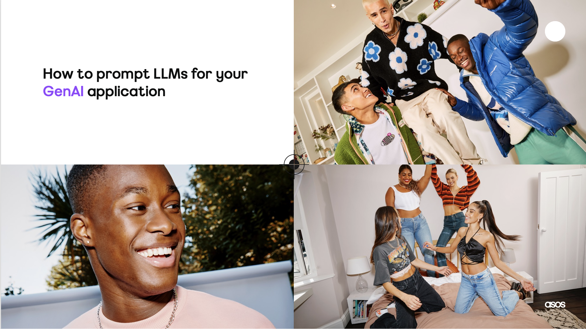
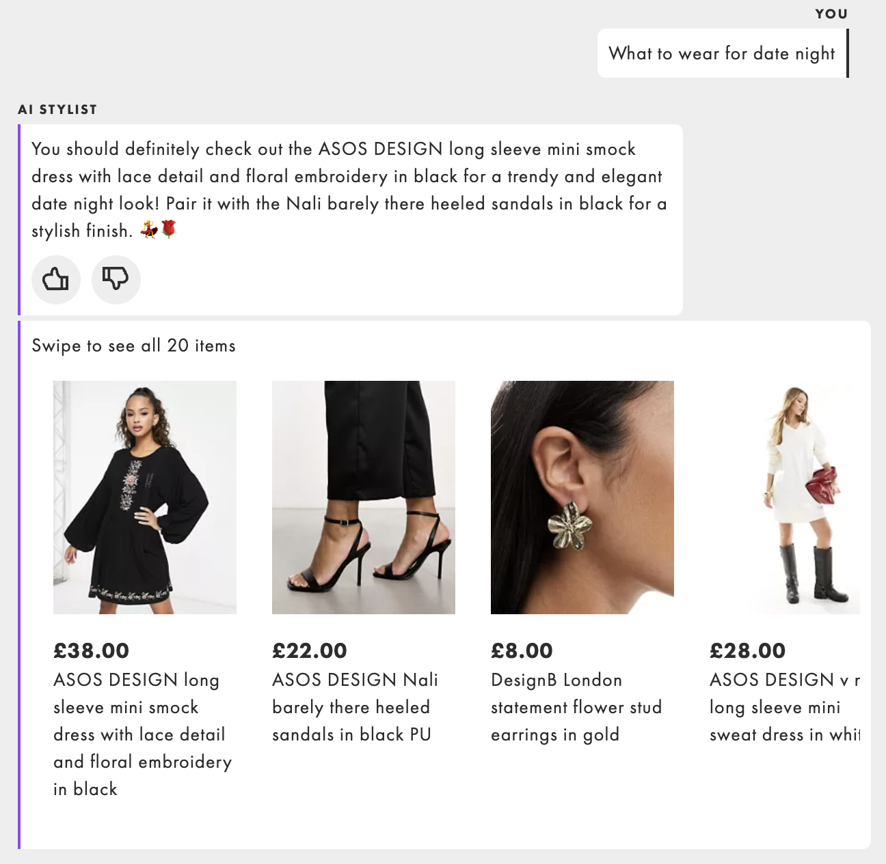
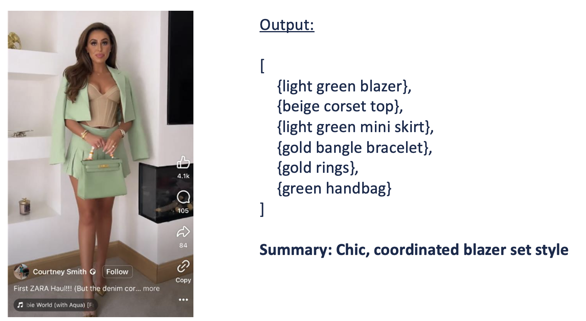
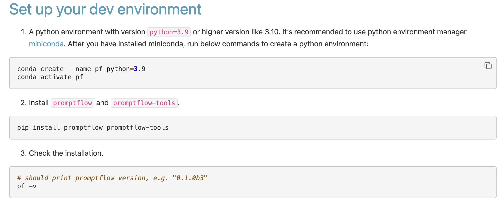
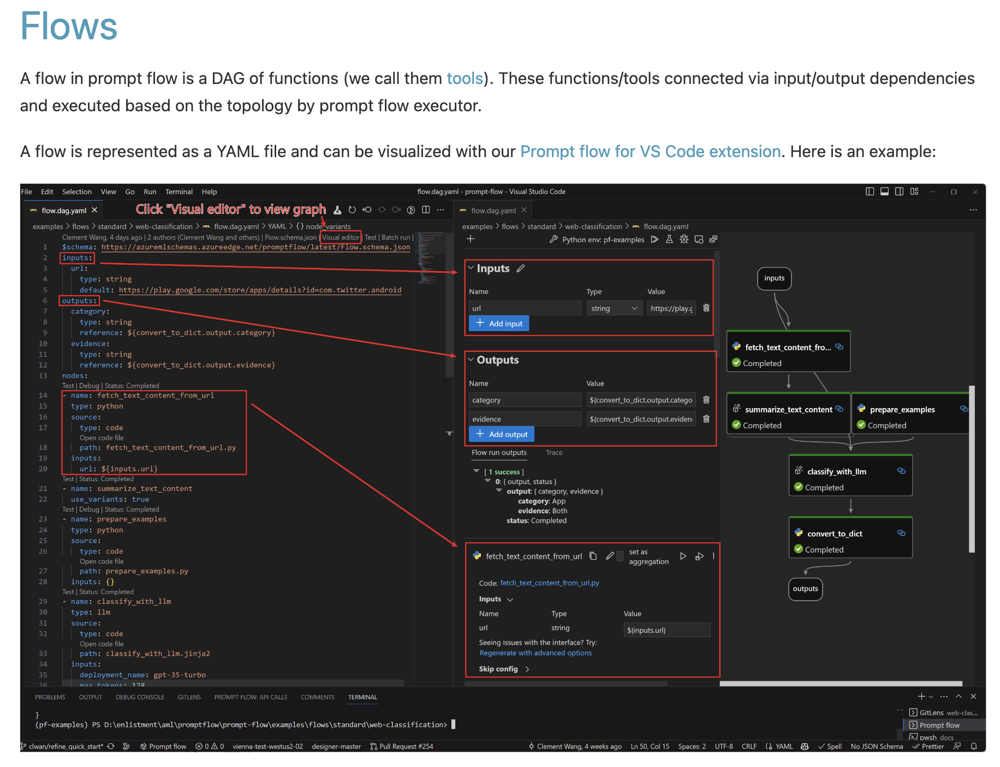
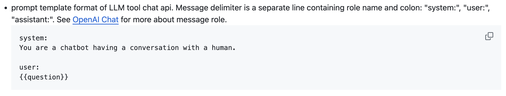
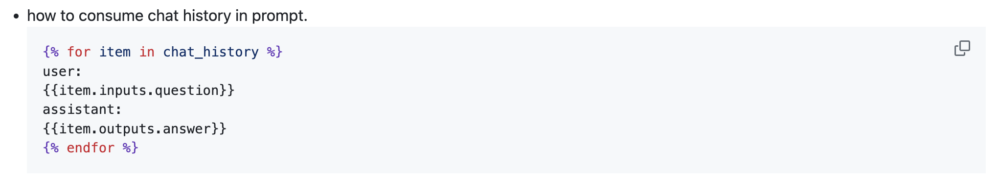

# genai-techdevelop
How to prompt LLMs for your GenAI application




* Part I - prompting 101
* Part II - introduction to prompt flow 

## Part I - Prompting 101 (20min)
Material inspired by OpenAI and Andrew NG class on cousera:

ChaGPT prompt Engineering for Developers

https://www.coursera.org/projects/chatgpt-prompt-engineering-for-developers-project

### A) What is GenerativeAI

_Generative artificial intelligence is artificial intelligence capable of generating text, images or other data using generative models, often in responses to prompts._ (source: Wikipedia)

### B) Why is it important?

The GenAI market is $11.3 billion in 2023 and will reach $51.8 billion by 2028 (source: Markets and Markets)

Example of GenAI models:
ChatGPT: Our AI Stylist was built by prompting ChatGPT asking the model to act as our personalised ASOS fashion stylist.



DALL-E: A vision model developed by OpenAI capable of photorealistc image generation from a simple descrpition in plain English (read more at https://asoscom.atlassian.net/wiki/spaces/DS/pages/4398973130/R+D+DALL-E)


GPT4-V: A GenAI model that accepts both text and image prompts (multimodal), it can reason from the content in the image and has the same capabilities as GPT-4 for text (read more at https://asoscom.atlassian.net/wiki/spaces/DS/pages/4397629494/R+D+gpt-4v+vision).



### C) Making requests to Azure OpenAI GPT 3.5
GenAI providers like OpenAI are known for training their models from user input data, instead we use our Entreprise access with Azure to ensure our proprietary data are not used for retraining the models, kept secure.

1. Azure OpenAI key: 1d0e668fdc424a04af2124483f1a63dc

2. Azure OpenAI endpoint: https://uksouth.api.cognitive.microsoft.com/

3. Azure OpenAI deployment name: aifashionassistant-gpt-35-1106

### D) Azure OpenAI Chat API
Call the Azure open ai chat api to generate a complete with GPT3.5

Use the key provided and the connection URL to make a simple call to our Azure OpenAI ChatGPT model

Open your first assignment [here](part1/simple_call.py)


### E) Model prompting with GPT 3.5
1. simple prompt - [Notebook](part1/1_simple_prompt.ipynb)

2. iterative prompt developement - [Notebook](part1/2_iterative_prompt_development.ipynb)

3. summarising contents - [Notebook](part1/3_summarising.ipynb)

4. inferring knowledge - [Notebook](part1/4_inferring.ipynb)

5. transforming data - [Notebook](part1/5_transforming.ipynb)

6. expanding - [Notebook](part1/6_expanding.ipynb)

## Part II - Introduction to Chat with prompt flow (20min)
Material inspired by Microsoft promptflow starter documentation 

https://microsoft.github.io/promptflow/

In part II we are developing a ChatGPT assistant application with conversation history

Things to look out for:

* ChatGPT does not have explicit memory, all previous messages in the chat history including the system prompt are served to the model on each call
* ChatGPT is not safe out of the box, it is your responsibility as a developer to implement guardrails (e.g start with asking the model to be a helpful and polite assistant)
* Azure ChatGPT can be attached to the Azure AI Content safety service to ensure brand and user safety by blocking innappropriate user inputs and model outputs.
* Entreprise (e.g Azure OpenAI) licensing means GenAI provide will not retain your proprietary data for retraining the model 

### Setup your dev env



### Promptflow project structure



Init your project by running: 
```
pf flow init --flow ./my_chatbot --type chat
```

then configure your Azure OpenAI deployment name in your project DAG:

```
$schema: https://azuremlschemas.azureedge.net/promptflow/latest/Flow.schema.json
inputs:
  chat_history:
    type: list
    is_chat_history: true
    default: []
  question:
    type: string
    is_chat_input: true
outputs:
  answer:
    type: string
    reference: ${chat.output}
    is_chat_output: true
nodes:
- name: chat
  type: llm
  source:
    type: code
    path: chat.jinja2
  inputs:
    deployment_name: aifashionassistant-gpt-35-1106
    max_tokens: '256'
    temperature: '0.7'
    chat_history: ${inputs.chat_history}
    question: ${inputs.question}
  api: chat
  connection: open_ai_connection
environment:
  python_requirements_txt: requirements.txt%    
```

### Create a promptflow connection with API key and base URL:

run 
```
pf connection create --file ./my_chatbot/azure_openai.yaml --set api_key=1d0e668fdc424a04af2124483f1a63dc --set api_base="https://uksouth.api.cognitive.microsoft.com" --name open_ai_connection
```

You can test your connection with:

```
pf flow test --flow my_chatbot  # "my_chatbot" is the directory name
```

You can chat with your ChatGPT Assistant

```
pf flow test --flow my_chatbot --interactive # "my_chatbot" is the directory name
```

Now prompt your assistant with the system message [here](my_chatbot/chat.jinja2), notice that all previous messages are given to the model along with the system prompt

Giving the system message and user question to promptflow:


Giving the chat history to promptflow:



###  Chat with Wikpedia

Learn about chaining to alternate between Pyhon steps and LLM steps in the DAG with promptflow tools, navigate to part2/chat_with_wikipedia

###  Function calling

Learn how to interface ChatGPT with external APIs using OpenAI function calling, navigate to part2/functions

## Wrap up
* use Azure to acces OpenAI models using our Entreprise licence
* check that Azure AI content safety is enabled in your deployment
* connect to a model using our Azure OpenAI key and base URL
* prompting summary
* prompt injection
* function calling

## Extend your knowledge

* Apply your newly acquired prompting skills to vision models (links to DALLE and 4V on confluence)
* Use plugins in promptflow (link to doc)
* Azure AI content safety was enable in our deployment (link to doc)
* Bulk tests and Groundedness
* RAG is when vector embeddings and ranking techniques are used to extract most relevant facts from knowledge database
* Azure Kubernetes Service (AKS) deployment

Keep in touch! fabon.dzogang@asos.com ai@asos.com
